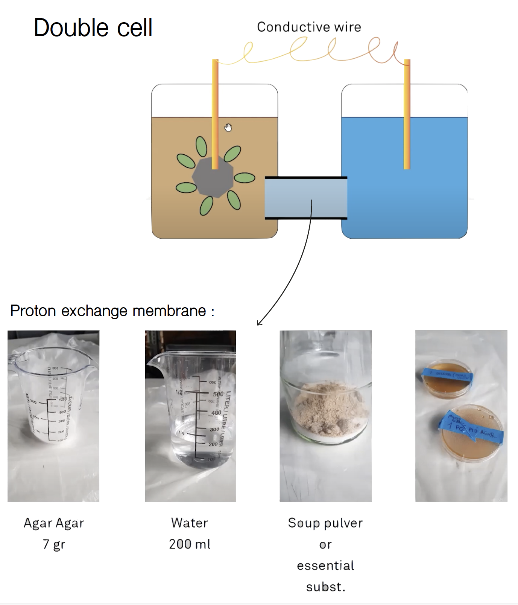
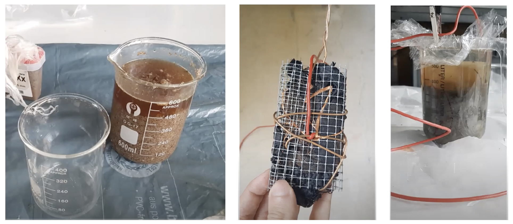
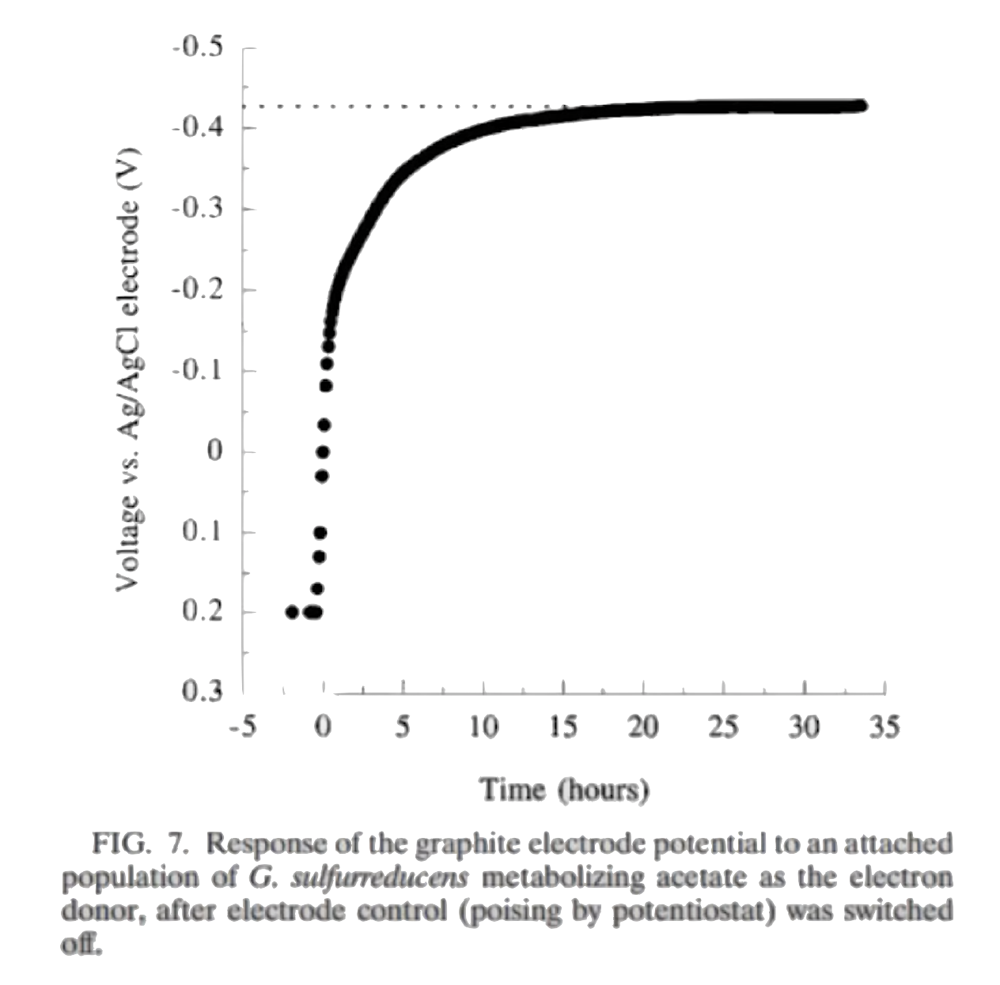
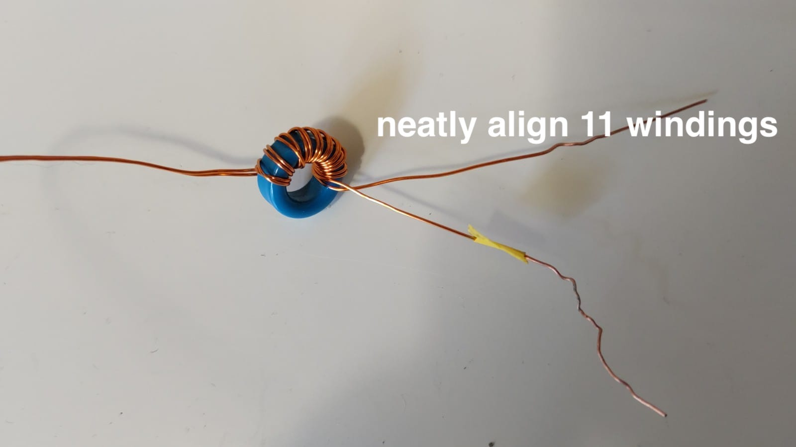
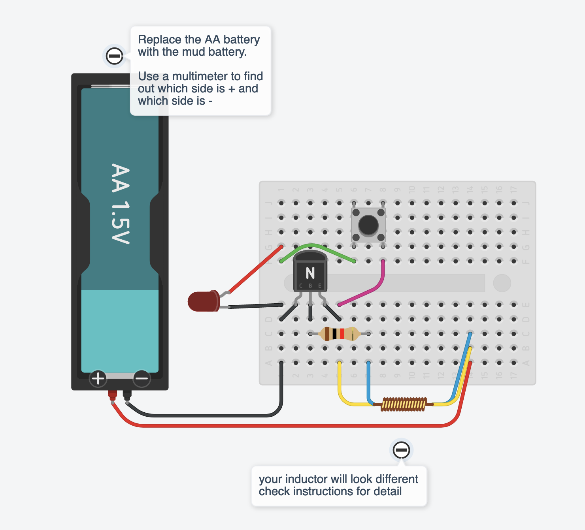
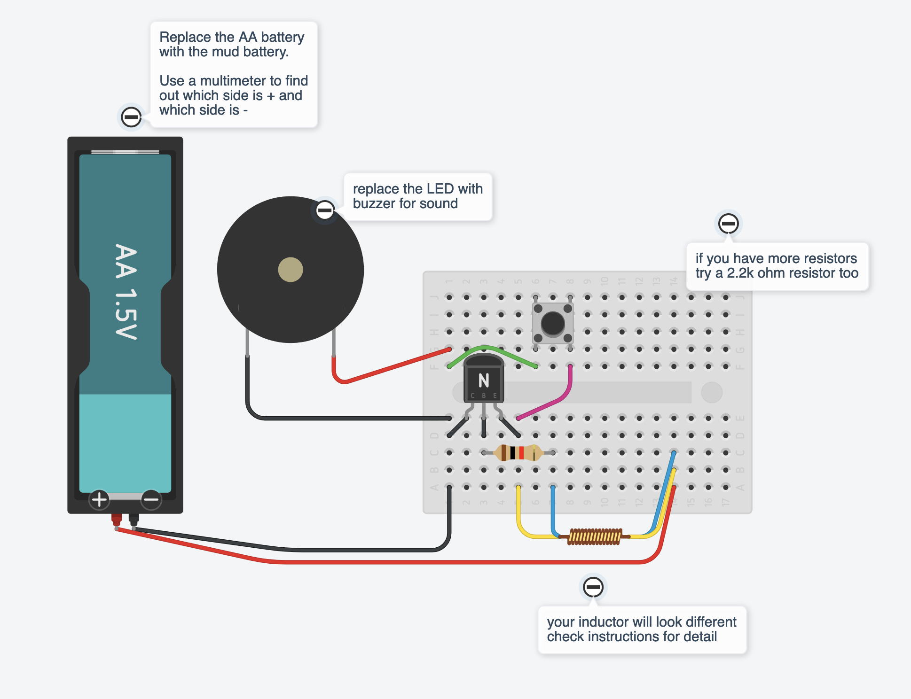

# Soilpunk workshop HDSA22

This workshop is developed by the two collectives Hackers 
& Designers and Hackitects in the context of the H&D Summer Academy 2022 "Connecting Otherwise. We invite participants and facilitators of the different nodes to imagine and try out ways to radically reduce the energy use associated with communication technologies such as the Internet and consider a low-tech approaches to 'connecting otherwise'. 

Some questions / points of discussion we want to explore through this hands-on workshop:

* making tangible abstract concepts around communication technology / technical infrastructure / connectivity
* problematizing and considering different narratives and vocabularies around 'the internet'
* negotiating problematic history of connectivity and communication infrastructure 
* the solarpunk approach: imagining and exercising desirable futures for communication technologies that are less wasteful, accessible, inequitable, self-reflexive and fun! 

The workshop incorporates two experimental approaches simultaneously: one that is focused on peeling back to the bare-bones of communication, and creating our own far from flawless but hyperlocal interpersonal protocols for information transfer. 

And secondly: by exploring the strategies from DIY biotechnology where bacteria found in local iron-rich soil are harnessed to generate and store energy. SoilPunk: muddy speculations on desirable techno futures. 

# Table of contents

1. [Materials and tools](https://github.com/hackersanddesigners/Soilpunk_joulethief#materials-and-tools)
2. [Prior knowledge that will come in handy](https://github.com/hackersanddesigners/Soilpunk_joulethief#prior-knowledge-that-will-come-in-handy)
3. [Workshop version 1 - in person](https://github.com/hackersanddesigners/Soilpunk_joulethief#version-1-in-person)
	* [Day 1 - duration: 3-4 hrs](https://github.com/hackersanddesigners/Soilpunk_joulethief#day-1---duration-3-4-hours)
	* [Day 2 - duration: 3-4 hrs](https://github.com/hackersanddesigners/Soilpunk_joulethief#day-1---duration-3-4-hours)
4. [Workshop version 2 - hybrid](https://github.com/hackersanddesigners/Soilpunk_joulethief#day-1---duration-3-4-hours)

# 1. Materials and tools

**For the mud battery**

*Materials*

@Hackitects, pls completes

* transparent containers (e.g. plastic bottles)
* mud collected from river beds and swamps where you can see reddish water (this is full of iron)
* metal mesh and metal wires (LENGTH?)
* conductive wire (LENGTH?)
* active coal or graphite (or any material that contains carbon)
* plastic tubes
* agar agar - 7 g
* broth powder (salts substance) - (AMOUNT?)
* water - 200 ml
* epoxy glue

*Tools*

* pot and stove to cook the agar mixture
* multimeter
* drill with a circle head cutter
* clippers
* breadboard

**For the joule thieves**

*Materials*

* a small breadboard
* an LED (and optional: a small buzzer)
* an NPN Transistor 2N3904 (this type has an EBC pinout which is pictured in the instructions, if you take another NPN transistor, check pinout and adjust accordingly)
* a 1K and/or 2K ohm resistor
* a ferrite toroid with an inner diameter of 9mm or so
* a 1.5V AA battery (doesn't need to be full)
* thin enameled copper wire, about 100 cm
* 2 crocodile clips
* a few jumper wires will be handy
* a momentary switch (a push button)
* an AA battery clip (1 cell)

*Tools*

* a lighter to melt the enamel off the copper
* sand paper (to sand the copper wire removing last bits of enamel)
* a multimeter
* clippers to cut wires

# 2. Prior knowledge that will come in handy

add info for mud battery

To build the joule thief you will need to have basic working knowledge of how to use a multimeter (or watch a couple of youtube videos and you'll be fine too). It's handy if at least one person has basic knowledge of how to build and troubleshoot a breadboard circuit. But just looking carefully at the images and checking your own set up will probably get you there as well! And you can contact us for help via Zulip! 

* [A multimeter tutorial](https://www.youtube.com/watch?v=bF3OyQ3HwfU)
* [How to use a breadboard](https://www.youtube.com/watch?v=6WReFkfrUIk)
* [Background info on how inductors work](https://www.youtube.com/watch?v=KSylo01n5FY)
* [	Video of someone else who made a joulethief](https://www.instructables.com/Joule-Thief-Circuit-How-to-Make-and-Circuit-Explan/)

# 3. Workshop version 1 (in-person)

Duration: 8 hours (2x4 hrs, should have a 15-35 hour break in between to charge battery)

Before starting: check kit and supplies (some shopping might be necessary)

## Day 1: Making biobatteries - duration: 3-4 hours

### Intro soil & geo-bacteria (pre-recorded video + written instructions) - approx 30 mins

**Additional details coming soon!**

The pre-recorded video and instructions will address the following quesitons: 

* What is a healthy soil? what lives in the soil?
* What is geobacteria? where to find it? how does it purify water? what does it need to generate electricity?
* What are types of soil batteries?
* What are 2 cell batteries ? what are important elements for a bacterial cell battery to properly work ? how much electricity does it generate?
* What is the protocol for creating a bacterial battery? what are the different parts needed? (membrane, wires, coal sheets..etc) how to prepare them?

**References** 

* [SmartKidsLab Waag - Measure Microbes](http://smartkidslab.org/content/english/3-microbenmeter/SmartKidsLab-Measure-microbes.pdf)
* [We Make Money Not Art - Bacteria Battery](https://we-make-money-not-art.com/bacteria_battery/)
* [Microbial fuel cell - Elbonian style](https://www.youtube.com/watch?v=_zCsAfEbVRc)

**Soil batteries? Geobacter!**

Scientists have experimented with a variety of bacteria, but one kind that environmental microbiologist Derek Lovly at the University of Massachusetts at Amherst and his colleagues have focused on is Geobacter, which is naturally found in many soils and sediments. 

*"Geobacter grows by breaking down organic materials and transferring electrons pretty much onto anything that looks like iron", he said. "It's up in the top of the list in terms of generating high power densities".*

When attacking environmental pollutants such as aromatic hydrocarbons, Geobacter can break down some 90 percent, Lovley said. All in all, systems incorporating Geobacter can recover up to nearly all the electrons within sewage. 

**Where to find geobacter?**

 [more info for nodes coming]

*Amsterdam-Noord, the Netherlands*

### The proton exchange membrane protocol - approx 45 mins

 [detailed steps will be provided]

* 5 mins re-explaining how to prepare the membrane.
* 10 mins preparation of the membrane:
	* Start with measuring 7grams of Agar Agar, and 200ml of water.
	* Mix the agar with the water and one cube of the broth powder in a pan and heat it till it boils around 20 sec.
	* Put the mix in the membrane tubes, after sealing one of the tubes sides with tape to avoid the liquid mix from leaking.
	* Place the filled tubes on the side to solidify

### Preparation for two cell battery - approx 30 mins

5 mins re-explaining how to prepare the 2-cells:

* Start by cutting out a circle in the plastic container (using the circle head cutter in a drill). it has the same diameter as the membrane. 
* Make two small holes on top of both containers to attach the membrane to them.
* Cut a circle from the stainless steel net. It has the same diameter and shape as the plastic container available to use for the batteries, so if the container has a regtangular section, the net should be cut as the same shape of the container.
* Connect the cut net to a wire.

### Building the batteries - approx 30 mins

Building cathodes (coal with grids and wires):

* Brush epoxy glue on the nets on both sides.
* Coat the brushed nets with the powdered active coal.
* Make sure all the net is covered with coal then press the coal on the net using a flat surface and force.

Filling the containers :

* Attach the solidified membrane to both of the containers. 
* In one of the containers place a layer of mud, smash it on the table to make sure that all the air bubbles are released.
* Place the cathodes on the mud container then add more mud and smash it again to ensure no air bubbles are in the mud.
* Fill the other container with clean water and place a wire in it. 

###Connecting the batteries in series and measuring the power - approx 30 mins

* Measure the Voltage across the 2-cell battery by touching the wires with the multimeter probes. 
* Register your results
* Connect the bateries to the breadboard and measure the Voltages. 

### Allow the bacteria to multiply and charge the biobattery for 15-35 hours

After assembling, each cell will need a minimum of 15 hours to generate 0.5V of electricity. Once it reaches this amount, we can continue with part two of the workshop.  

--------------------------

## Day 2 - Rethinking communication protocols - duration: 3-4 hours

Today we make an inductor circuit (joule thief) to amp up the small voltage we get from the mud battery. Take a look at [this video](https://www.instructables.com/Joule-Thief-Circuit-How-to-Make-and-Circuit-Explan/) to get the basic idea. We will replace the AA battery with our mud battery, and we will add a button to this circuit (and optional: a buzzer) to use it to make light and sound signals. Thus, we are creating the basic setup for encoding and sending information (on/off, zeros/ones, lights/no light, sound/no sound). 
With this workshop and the simple parameters it provides we propose to explore the concept of communication protocols that we encounter every day in implicit and explicit ways, AND create our own protocols for communication using a very bare bones, hyperlocal, low energy infrastructure!  

### Shared activity with all nodes: Collective reading 

As part of our workshop we propose to read the following text: Byfield, Ted (2008) “Information” in: Matthew Fuller (ed) *Software Studies: a Lexicon*. Massachussetts, MIT Press: p. 125-131.
[PDF here](https://www.google.com/url?sa=t&rct=j&q=&esrc=s&source=web&cd=&cad=rja&uact=8&ved=2ahUKEwiVsvmbrtf4AhXCuKQKHaMcBe8QFnoECA8QAQ&url=https%3A%2F%2Fmonoskop.org%2Fimages%2Fa%2Fa1%2FFuller_Matthew_ed_Software_Studies_A_Lexicon.pdf&usg=AOvVaw3hRsaRblaUFCh9FChmyOqc)

Then, let's meet on this [Etherpad](https://etherpad.hackersanddesigners.nl/p/soilpunk-workshop-hdsa2022) with all nodes on **Tuesday 9.00-10.00AM CET = 4.00-5.00 PM KST = 7.00-8.00 PM NZST** to discuss the text together. We will prepare some questions and prompts that will be released to activate and create a dramaturgy for the discussion in the pad. 

We will also have a [BBB room](https://bbb.constantvzw.org/b/hd4-tzj-me3-3sa) open. But most of the discussion will happen in writing on the pad. We hope through this shared moment we can facilitate an moment of connectedness across nodes/scripts/space/time.

### Intro by H&D - approx 60 mins

##### [Short 5 min max prerecorded video by H&D about the idea and set up of the workshop]

*will be added ASAP*

- solarpunk as concept/approach/genre we're interested in
- idea and set up of this part of the Soilpunk workshop

##### Collective exercises to set the scene for this workshop:  

The purpose of the following exercises is to exchange associations and thoughts about communication protocols in different contexts (walkie talkies, telephones, smoke signals, secret communication with classmates during exams, serial/SPI/I2C communication between computer chips, IP, interactions at the water coffee machine) and to get a collective sense of what the knowledge and interest are of the group in relation to the topic of *alternative communication protocols*. We do not expect prior knowledge or answers/solutions to problems but depart from and work with the imagination and fascinations of the respective groups.

Hopefully by the end of the exercises we have to accumulated a collective vocabulary that sets into motion a direction for the communication protocols you will be making!

You could use an Etherpad (create your own pads here: [https://etherpad.hackersanddesigners.nl](https://etherpad.hackersanddesigners.nl)) or use a large piece of paper for this exercise.

**Exercise 1:**

*Facilitators release one question at a time and set a timer of 5 minutes per question:*

1. What do you associate with the term 'transmitting' -- 5 min
2. What do you associate with the term 'receiving' -- 5 min
3. What do you associate with the notion 'making yourself understood' -- 5 min
4. What do you associate with the notion 'feeling understood' -- 5 min

Responses to these prompts can be questions, openings, contradictions, fictions, ... _there is no right or wrong._ If there is time left, facilitators can invite participants to read some of the responses out loud and react to them.

**Exercise 2:** 

*Facilitators release one question at a time and set a timer for each question (minutes indicated)*

We all experience troubled transmission all the time. Broken connection, low bandwidth, frozen faces.... all gestures of infrastructures that tell but one thing "Connectivity is not to be taken for granted". 

1. Gather in groups of 3 
2. Pick a scenario of online communication/collaboration that everyone in your group has at some point experienced (i.e. a video conferencing platform, whatsapp call, discord messaging, twitch streaming...) -- 5 min
3. Make an extensive inventory of utterances of 'bad' connectivity within online communication (i.e. frozen face,...) -- 10 min
4. Pick one that you find particulary irritating and come up with a protocol that caters to the situation. -- 15 min

**Potentially relevant background information:**  

* [Wikipedia page of Communication Protocols](https://en.wikipedia.org/wiki/Communication_protocol)
* [Youtube video "RFID Lab 1: Serial Peripheral Interface (SPI)"](https://youtu.be/kkMVv0dMavM) 
* ["S.M.S., smoke as a medium for the masses" by Dennis de Bel](http://dennisdebel.nl/2017/2014-sms2.0/)
* [Byfield, Ted (2008) “Information” in: Matthew Fuller (ed) *Software Studies: a Lexicon*. Massachussetts, MIT Press: p. 125-131.](https://www.google.com/url?sa=t&rct=j&q=&esrc=s&source=web&cd=&cad=rja&uact=8&ved=2ahUKEwiVsvmbrtf4AhXCuKQKHaMcBe8QFnoECA8QAQ&url=https%3A%2F%2Fmonoskop.org%2Fimages%2Fa%2Fa1%2FFuller_Matthew_ed_Software_Studies_A_Lexicon.pdf&usg=AOvVaw3hRsaRblaUFCh9FChmyOqc)
* *The commons: Infrastructures for troubling times* by Lauren Berlant (this text is part of the reader)

**References from the world of computing:**

* I2C protocol (note the insert on changing terminology to describe relationship between devices): [https://learn.sparkfun.com/tutorials/i2c/all](https://learn.sparkfun.com/tutorials/i2c/all)
* Binary counting system: [https://learn.sparkfun.com/tutorials/binary](https://learn.sparkfun.com/tutorials/binary)
* SPI protocol: [https://learn.sparkfun.com/tutorials/serial-peripheral-interface-spi/all#whats-wrong-with-serial-ports](https://learn.sparkfun.com/tutorials/serial-peripheral-interface-spi/all#whats-wrong-with-serial-ports)

### Make a Joule Thief - approx 90 mins

This paragraph describes how you can build an inductor circuit that can power an LED with as little as 0.5V (in comparison: typically you need 2V). Our mud battery is likely to be able to supply this amount after 24 hours if all went well. We added a button to the circuit so the device can double as an extremely simple communication device. By connecting the LED you can send light patterns using the button. If you replace the LED with the little buzzer you can send sound signals. 

**update image with version that has corresponds w diagramss**

Build a joule thief circuit with the components provided, following the step-by-step instructions in the script (will be translated adaptation of this [Dutch tutorial](https://ingegno.be/realisations/jouledief.html)) There are a lot of similar tutorials so if anything is unclear it's worth looking around a bit, maybe somebody else has a way of explaining that is clearer for you :) 

[Example of the working circuit with a LED](https://www.youtube.com/watch?v=umFwwJs-5BA)

[Example of the working circuit with a buzzer](https://www.youtube.com/watch?v=va7Zxcri2gk)

##### Step 1: prepare the inductor 

* Gather the tools and materials listed at the top. 

- take approx. 100cm of enameled copper wire and fold in half
- try not to make bumps and tangles, keep wire nice and smooth
- loop the closed end through the ferrite toroid, keep about 4 cm 

- make 11 windings with the double, make sure they sit next to each other neatly
- clip the ends, make sure you have about 4 cm left
- now clip the closed end of the loop from the beginning of the coil

- you now have 2 separate wires wrapped around the ring, creating 4 loose leads: 2 at the beginning, and 2 at the end of the coil
- take a multimeter and match which lead at the beginning is connected to an end lead (use the continuity setting, if it beeps, it's the same wire).

 
- what we now want to do is take a lead from the beginning of (and going into) the coil, and connect it to an one of the end leads coming out of the coil. But these two should not be the same wire! So check with the multimeter that it's the other wire you are connecting (see images). Wrap these around each other a couple times, making sure you still have 2 cm untangled wire at the end. In the pictures we marked the two different wires with two piece of tape before coiling, then you can see it without a multimeter too. 

- now for all four ends, take a lighter and burn off the plastic enamel wrapping the copper wire (you might not see it but it's there and acts as an insulator, preventing electricity to go through). 
- sand off the ends until you see copper color that is slightly lighter than before.
- this is your inductor! the two connected leads will be connected to the positive + side of your AA or mud battery, and the two other separate leads are connected to the transistor and the resistors as shown in the images of the circuit. 

##### Step 2: make the circuit with an LED

Gather all your components. These should be in the kit provided to your node, or if you are a remote participant, you will have received a shopping list. The parts might look slighty different but recognisable. You will also receive a battery clip for easier connecting to the breadboard with crocodile clips.

**LED**
Note that this part has polarity, so should be connected with the right orientation. The LONGER leg (usually with the bend) is marked in RED in the diagrams. The SHORTER leg is marked in BLACK in the images and is always connected to GND (or -).

**NPN transistor**: Note that this part also has an orientation. In the diagram you see that the transistor's flat side is facing you, and the round side is facing the away. Make sure you copy this orientation when you connect it to your breadboard.

**Your inductor coil** obviously looks different :) In the diagram you see the two wires making up the coil marked with a different color (blue or yellow). Ours are both copper colored but you will have marked them with tape or measured with a multimeter. The leads on the right are connected to row 14, with the + side of your battery. You can either wrap them making one leg so to speak, or keep them separated and just connect both on row 14. Both options are a way of connecting them.

The leads on the left side of the coil are not connected to each other. One goes to the right leg of the transistor (row 5) and one is connected to the the resistor (row 7).

**Button**: has 4 legs. In the diagram, the two legs on the left are connected, and the two legs on the right side are connected too. When the button is pressed, the left side and the right side make a connection too (allowing electrons to flow). On the back side you can see marks showing you which legs are connected. If unsure, check with the multimeter (continuity setting). If your button is not working, you can try rotating it 90 degrees, you might have it connected in the wrong orientation.

**Resistor** has no orientation, either way is fine. You can influence the working of the circuit a bit by trying different values. If you have more resistors: try some in the range of 400-2000ohm and see what happens!

In case you want to know the schematic (a bit abstract but can be helpful sometimes)

##### Step 3: test the circuit with a 1.5V battery

Check that your circuit works by connecting one 1.5V AA battery to it. The LED should go on when you press the button. If it doesn't work: 

1. check all the connections again, wiggle them a little, make sure they're firmly in the breadboard
2. check again that all the connections are in the right rows/columns on the breadboard
3. try another battery (safe bet is to try with one that has at least 1V left)

*Optional*: replace the LED with a buzzer to send sound signals. The sound may be lower/higher depending on the amount of windings in your coil, and the Voltage of the battery. Changing the value of the resistor can tweak this a bit (try some resistors in the 200-2000 Ohm range if you have them).

##### Step 4: connect the mud battery to the circuit

Test the mud batteries with a voltmeter and find the positive and negative pole.

* Find the positive and the negative pole. If you try to measure the Voltage of the battery and the display gives a negative images: your probes are the wrong way around (you're holding the black lead to the positive pole of the battery instead of the negative pole). If it reads a positive value: your red probe is touching the positive pole and the black probe is touching the negative pole. With this information you should be able to replace your AA battery with the mud battery the right way around. 
* if it measures 0.5V or higher proceed with single battery
* if it measures less than 0.5V, connect two batteries in series. For more info: [https://www.batterystuff.com/kb/articles/battery-articles/battery-bank-tutorial.html](https://www.batterystuff.com/kb/articles/battery-articles/battery-bank-tutorial.html) 

### Design a communication protocol for your device - approx 90 mins

Pair up or make groups to design a communication protocol. How can you convey information with only on/off? How does the receiver now when to be alert? How do they know when the message is ended? Communicating is as much about listening as it is about sending. What might be ways to attune? How might this translate to the simplest of forms? In comparison: a simple walkie talkie protocol entails some agreements such as: 

* opening with: "person A to person B, over"
* responding with: "person B to person A, over"
* closing with: "over and out"

Here you see there's a certain signal dedicated to alert the listener(s) that a message is coming and they should keep their eyes/ears peeled. And similarly, when they can rest easy. The sender might want to know that the listener is actually there and they're not taking to a wall.  Or that the message did or did not come across clearly and they might need to repeat. 

Research and think a bit more on this together, and try to create an analog communication protocol for your joulethief messaging device. Some questions to think about when designing a protocol:

* the scale from bits to meaning (from on/off to full-blown storytelling and everything in between), what do you want to convey? e.g. an SMS (160 characters), an emoji, an image, a phone number, a piece of music, other, calling your dog to come back into the house, other? 
* speed (how fast can you speak/listen?)
* size (how long can you speak/listen?)
* access (who can speak/listen on your channels?)
* time (making sure you are on the same clock)
* how to identify the start of communication? 
* how to identify the end of communication? 
* how to make sure someone is actually listening?

### Bringing it all together - approx 60 mins

* Connect your joule thief to the mud battery and see if it works. We haven't tried this yet, so it really is an experiment! 
* Try sending information using your joulethief, using your communication protocol
* Share the resulting messages, discuss how and when entropy (noise) entered the process
* Display your mud batteries with LED lights in your space :) 

------------------

## WORKSHOP VERSION 2 (HYBRID) 

Duration: from 4 hours (half a day) up to 8 hours spread out over 2 days, depending on selected activities

Materials list should be shared with remote participants ASAP so they can order components and do shopping.

Node facilitates a session for participant to pair up based on shared interest, choose one or more of the following:

* Join the collective reading moment that will take place inside this [etherpad](https://etherpad.hackersanddesigners.nl/p/soilpunk-workshop-hdsa2022) with all nodes on **Tuesday 9.00-10.00AM CET = 4.00-5.00 PM KST = 7.00-8.00 PM NZST** to discuss the text from the Software Studies Lexicon. 
* Make a mud battery (work together remotely in small groups, those who were able to get materials), note that it needs to rest to charge! 
* Make a joulethief (those who were able to get the materials) and use it with an old half-empty AA battery
* Design a communication protocol and test it out via webcam/audiocall. This can be done with readily available household materials, like a small torch or penlight, knocking on the table for sound, flashing a red piece of paper at a webcam.

Before starting: decide on moments to check back in together, and when you will stop working on the activity, and how and when you would like to wrap it up (e.g. sharing and discussing with all participants in the node). 

