# Soilpunk workshop HDSA22

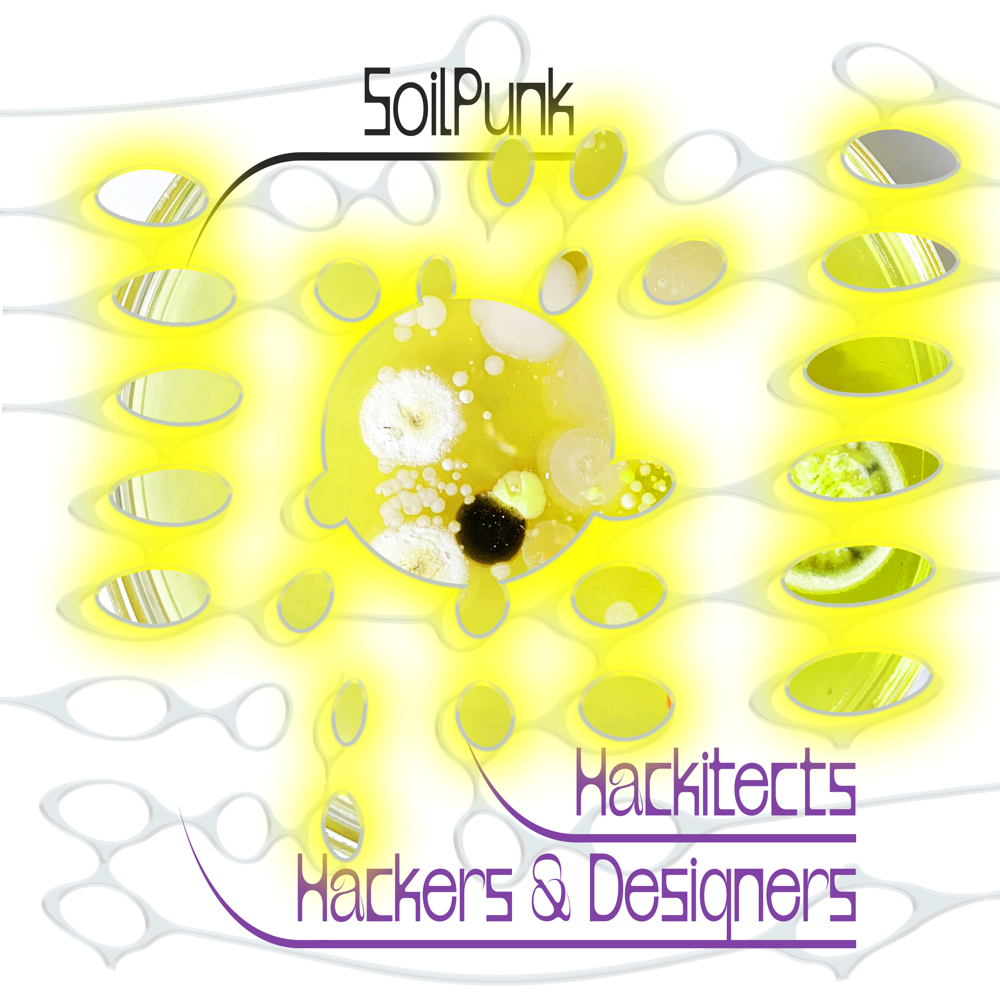

This workshop is developed by the two collectives Hackers 
& Designers and Hackitects in the context of the H&D Summer Academy 2022 *Connecting Otherwise*. We invite participants and facilitators of the different nodes to imagine and try out ways to radically reduce the energy use associated with communication technologies such as the Internet and consider a low-tech approaches to 'connecting otherwise'. 

Some questions / points of discussion we want to explore through this hands-on workshop:

* making tangible abstract concepts around communication technology / technical infrastructure / connectivity
* problematizing and considering different narratives and vocabularies around 'the internet'
* negotiating problematic history of connectivity and communication infrastructure 
* the solarpunk approach: imagining and exercising desirable futures for communication technologies that are less wasteful, accessible, inequitable, self-reflexive and fun! 

The workshop incorporates two experimental approaches simultaneously: one that is focused on
exploring strategies from DIY biotechnology where bacteria found in local iron-rich soil are harnessed to generate and store energy. And secondly, by peeling back to the bare-bones of communication, and creating our own far from flawless but hyperlocal interpersonal protocols for information transfer. SoilPunk: muddy speculations on desirable techno futures. 

**Steps for facilitators:**

It's a good idea to prepare by reading the whole script well before starting the workshop. Below is a summary of the steps involved for facilitators:

1. 3-5 days before workshop part 1: collect additional materials and tools that are not included in the kit (allow time in case you have to order any or scout for the right type of mud) [jump to materials and tools](https://github.com/hackersanddesigners/Soilpunk_joulethief#1-materials-and-tools)
3. Read the text suggested for part 2 and join our etherpad discussion! (If you didn't manage to read all of it you can still join!) approx 45 mins [jump to reading activity](https://github.com/hackersanddesigners/Soilpunk_joulethief#shared-activity-with-all-nodes-collective-reading)
2. Do workshop part 1 with the participants in your node! approx 3 hrs [jump to part 1 program](https://github.com/hackersanddesigners/Soilpunk_joulethief#part-1-making-biobatteries---duration-3-hours)
4. Do workshop part 2 with the participants in your node! approx 4 hrs [jump to program part 2](https://github.com/hackersanddesigners/Soilpunk_joulethief#part-2---rethinking-communication-protocols---duration-4-hours)

# Table of contents

1. [Materials and tools](https://github.com/hackersanddesigners/Soilpunk_joulethief#1-materials-and-tools)
2. [Prior knowledge that will come in handy](https://github.com/hackersanddesigners/Soilpunk_joulethief#2-prior-knowledge-that-will-come-in-handy)
3. [Workshop version 1 - in person](https://github.com/hackersanddesigners/Soilpunk_joulethief#3-workshop-version-1-in-person)
	* [Part 1 - duration: 3-4 hrs](https://github.com/hackersanddesigners/Soilpunk_joulethief#part-1-making-biobatteries---duration-3-hours)
	* [Part 2 - duration: 3-4 hrs](https://github.com/hackersanddesigners/Soilpunk_joulethief#part-2---rethinking-communication-protocols---duration-4-hours)
4. [Workshop version 2 - hybrid](https://github.com/hackersanddesigners/Soilpunk_joulethief#workshop-version-2-hybrid)

##  Part 1: Mud Battery protocol

## Facilitators: collecting mud for the battery

Look for reddish brown soil (rich in iron) near river beds and swamps, areas where water has a reddish color. Preferably collect deep samples not from the surface. 

About 1 liter makes 2 batteries. Ideally you get it a few days before the workshop, but it should be fine for up to two weeks. It is always good to collect more mud than what you calculate, in case some spill during preparations. 

Make sure you take mud as well as some water (see image below).

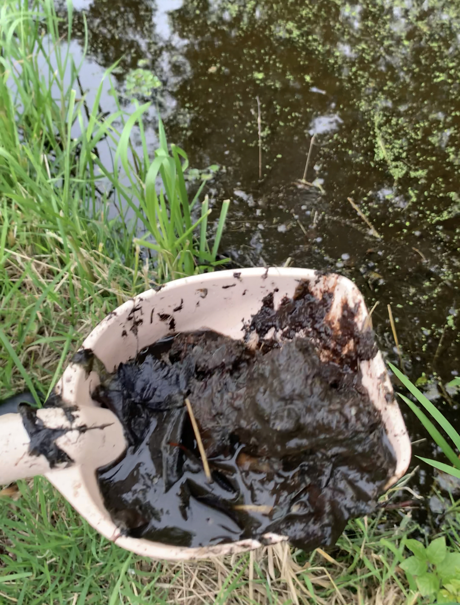

### Tools for the mud battery

* pot and stove to cook the agar mixture
* multimeter
* clippers and wire stripper
* breadboard (included in kit)
* kitchen scale

### Materials for the mud battery

- Mud (samples should be collected in advance)
- Containers with big opening on top( ex: glass jar or plastic - around 1L)
- Electric wires ( Copper wires 30 cm - 2 wires are needed per battery)
- Stainless steel grids to be cut in rectangles. Size : around 8 x 8 cm, but can change according to the size and shape of your container. Aluminium nets are good to use but they are less conductive. You can use also kitchen strainer mesh. You can also experiment with the size of the net, for example: making it like a strip 8 x 20, to have more surface area. In this case tou can roll it without making the surfaces touch.
- Epoxy glue (included in kit)
- Small brush to spread the glue.
- Active coal (included in kit)
- Agar ( 10 g is needed per 1 L battery)
- Salts substances (any broth powder - 1 pack, 2 g per battery). Broth powder is the one you use for cooking. We used the veggie broth cubes that you buy from the supermarket to add to your soup for instance. 
- LED (included in kit)
- Pot, Stove & scale
- Drinking Water
- Liquids measuring cup
- Tape (or anything to mark different wires)

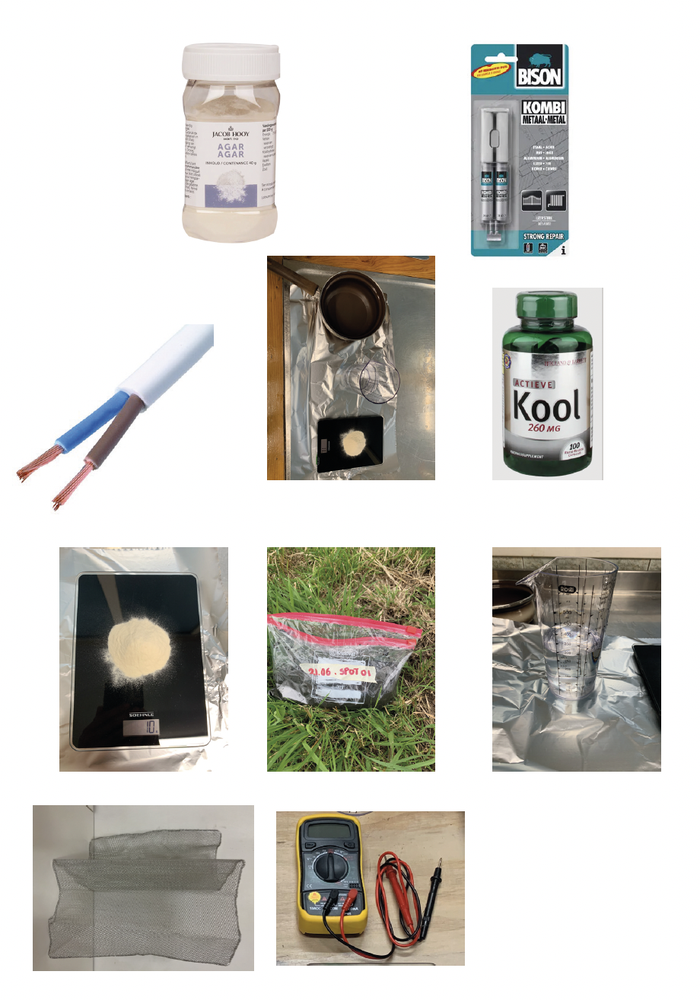

## Materials & tools for the joule thieves

### Included in kit sent by H&D:

We sent each node a box with kits that contain the following PLUS a battery clip (not pictured). We will send each node the tracking information so you can keep track. If it arrives too late, you can source your own, or (tip from Adam Ben-Dror) find a CFL bulb at a recycling place or second hand store and take it apart to harvest a coiled toroid and transistor from there! The other parts are available at any prototyping store. 

One components kit (for **two** participants) contains: 

* a small breadboard 
* an LED (and optional: a small buzzer) 
* an NPN Transistor 2N3904 (this type has an EBC pinout which is pictured in the instructions, if you take another NPN transistor, check pinout and adjust accordingly) 
* a 1K ohm resistor 
* a ferrite toroid with an inner diameter of 9mm or so
* a 1.5V AA battery (doesn't need to be full) 
* thin enameled copper wire, 0,3 mm core, about 100 cm 
* 2 crocodile clips 
* 4 jumper wires 
* a momentary switch (a push button) 
* an AA battery clip (1 cell) 
* piece of sanding paper

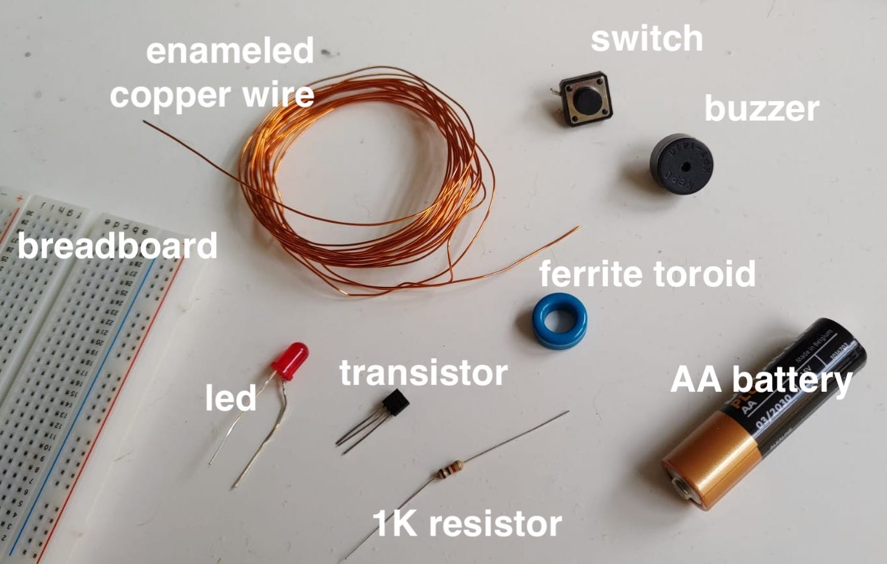

### NOT included in kit:

* 12-15 cm or three short pieces of solid core hook-up wire (22 AWG such as [this](https://www.sparkfun.com/products/8024) could be useful to make the leads of the coil sturdier (NOT INCLUDED IN THE KIT, sorry we realized a bit late).

### Tools for the joule thieves:

* a lighter to melt the enamel off the copper
* a multimeter
* clippers to cut wires
* a soldering iron
* some soldering tin
* a third hand (a person, some clothes pegs or a stand with clamps)

# 2. Prior knowledge that will come in handy

To build the joule thief you will need to have basic working knowledge of how to use a multimeter (or watch a couple of youtube videos and you'll be fine too). It's handy if at least one person has basic knowledge of how to build and troubleshoot a breadboard circuit. But just looking carefully at the images and checking your own set up will probably get you there as well! And you can contact us for help via Zulip! 

* [A multimeter tutorial](https://www.youtube.com/watch?v=bF3OyQ3HwfU)
* [How to use a breadboard](https://www.youtube.com/watch?v=6WReFkfrUIk)
* [Background info on how inductors work](https://www.youtube.com/watch?v=KSylo01n5FY)
* [	Video of someone else who made a joulethief](https://www.instructables.com/Joule-Thief-Circuit-How-to-Make-and-Circuit-Explan/)

# 3. Workshop version 1 (in-person)

Duration: 4 hours 

## Part 1: Making biobatteries - duration: 3 hours

### Intro soil & geo-bacteria (video + facilitator manual) - approx 15 mins

**Additional details coming soon!**

**References** 

* [SmartKidsLab Waag - Measure Microbes](http://smartkidslab.org/content/english/3-microbenmeter/SmartKidsLab-Measure-microbes.pdf)
* [We Make Money Not Art - Bacteria Battery](https://we-make-money-not-art.com/bacteria_battery/)
* [Microbial fuel cell - Elbonian style](https://www.youtube.com/watch?v=_zCsAfEbVRc)

**Soil batteries? Geobacter!**

Scientists have experimented with a variety of bacteria, but one kind that environmental microbiologist Derek Lovly at the University of Massachusetts at Amherst and his colleagues have focused on is Geobacter, which is naturally found in many soils and sediments. 

*"Geobacter grows by breaking down organic materials and transferring electrons pretty much onto anything that looks like iron", he said. "It's up in the top of the list in terms of generating high power densities".*

When attacking environmental pollutants such as aromatic hydrocarbons, Geobacter can break down some 90 percent, Lovley said. All in all, systems incorporating Geobacter can recover up to nearly all the electrons within sewage. 

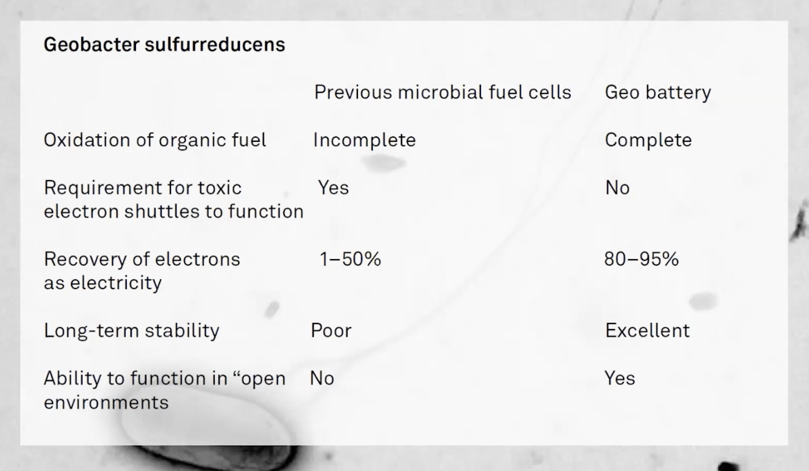

**Where to find geobacter?**

*Amsterdam-Noord, the Netherlands*

### Making the mud battery - approx 150 mins

#### 1. Making the Cathodes
To make the cathodes you need the active coal, epoxy glue, metal nets and electric wires.

- First empty the pills of the active coal provided to get the powder out, and place it on a sheet. (about 10 pills powder per 1 cathode disc)

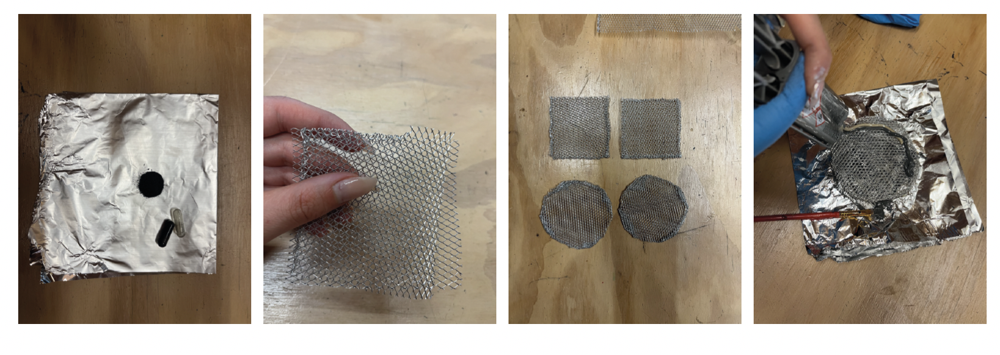

- Secondly, cut two net in a rectangular shape 8x8cm. place them in opposite directions and fold the edges so they are attached. We make two layers so it can hold the glue and coal well.

- Then brush the glue on the net and make sure that you add enough glue and that it is brushed evently on the surface of the net. Cover the brushed net with the active coal powder and press it very well. After pressing, add coal and press again. It is very important that the coal is covering the whole surface.

- After making sure that all the net is covered and pressed with coal, connect the net from one of the sides to an electric wire. At the end you might need to bend the net to fit your container. Bend it, but be sure not to make the edges touch each other. More coal surface is better! Now leave it to fully dry. 

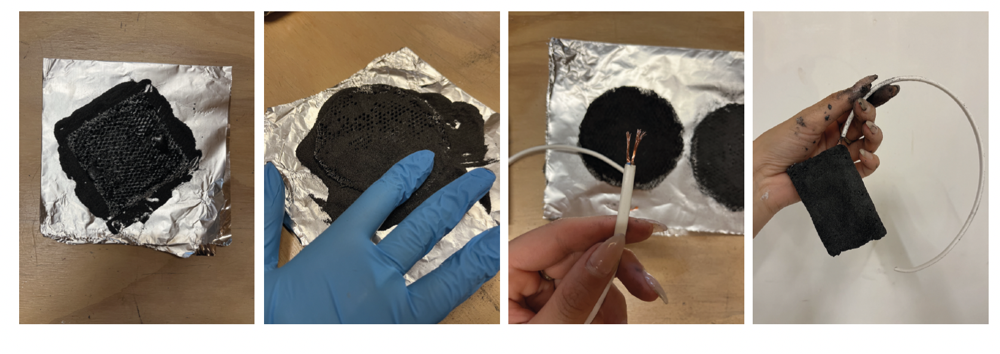

#### 2. Preparing first part of the Soil Battery

For this step you need the container (glass jar), mud, the dried cathodes.

- First put the cathode in the container (make sure that the glue dried and the coal is stuck to it).

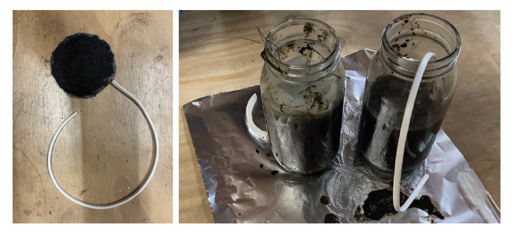

- Secondly, fill the jar with mud so it covers the cathode, keeping the wire out of the container.
- Mark the wire with tape to identify that its negative. (black = negative)
- Then hit the container to get all the trapped air bubbles out. It is VERY IMPORTANT to release the air bubbles from the mud.

#### 3. Making the proton exchange membrane

Per battery: to make the membrane you need 10 gram Agar, 285ml
water, 2 gram broth powder, stove, and pan.

- First put the agar, broth and water in a pot on low temperature. keep on stirring the mix.
- wait 3 minutes after boiling, then turn off the fire.
- Wait until the temperature of the mixture goes down. When it cools down the mixture become harder until its gelatine. That’s why it’s important to not wait until it’s cooled down completely.
- While the mix is still somehow warm and in a liquid state. You pour the mixture in the jar over the soil. **This is step must be done in 2 parts.** First add half of the mix and make sure that the cathode wire is coming out from the middle. Wait 1 minute then add the second half, to make sure that the first layer hardens, stays over the soil and not mix with it. Also, make sure to keep the wire of the cathode in the center while the agar is hardening. This would be easier to follow the next steps.

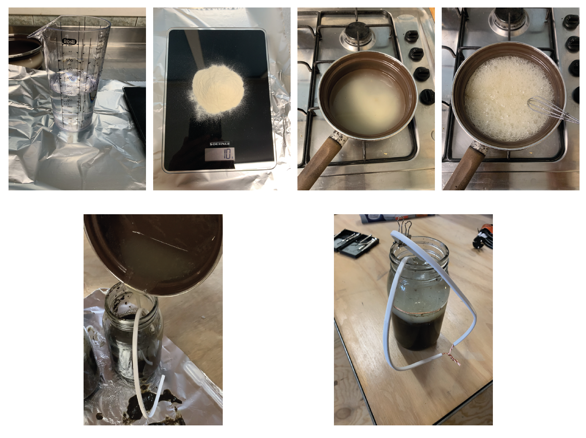

- After pouring the agar in the jar,wait for 10 mins so the agar is completely hard and settled.
- Make sure the top part of the jar over the agar is clean from any mud. If not, you should clean it using a tissue. 
- Add water on top of the agar so it fills the jar.
- Add a wire in the water. Mark this wire with a different tape as positive. (Red = positive)
- Measure the current with multimeter. Check the voltage and the current(A).
- We get a ready of 1V when the battery is freshly made.

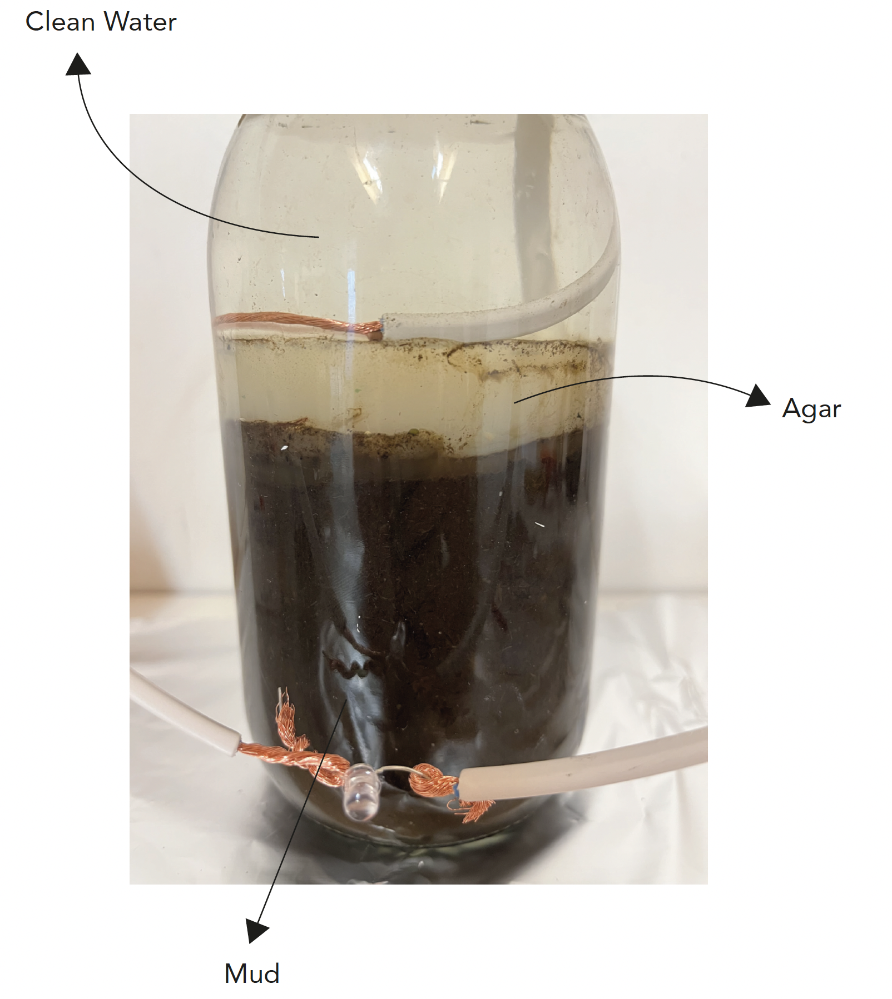

#### 3. Connecting the batteries in parallel

- The water part in the battery is (+) and the mud part is (-). When connecting two batteries in pralel the (-) from the first battery should be connected to the (-) in the second one, and the (+) from the first to the (+) in the second. Then the (-) and (+) should be connected togather to close the circuit. See the drawing: 

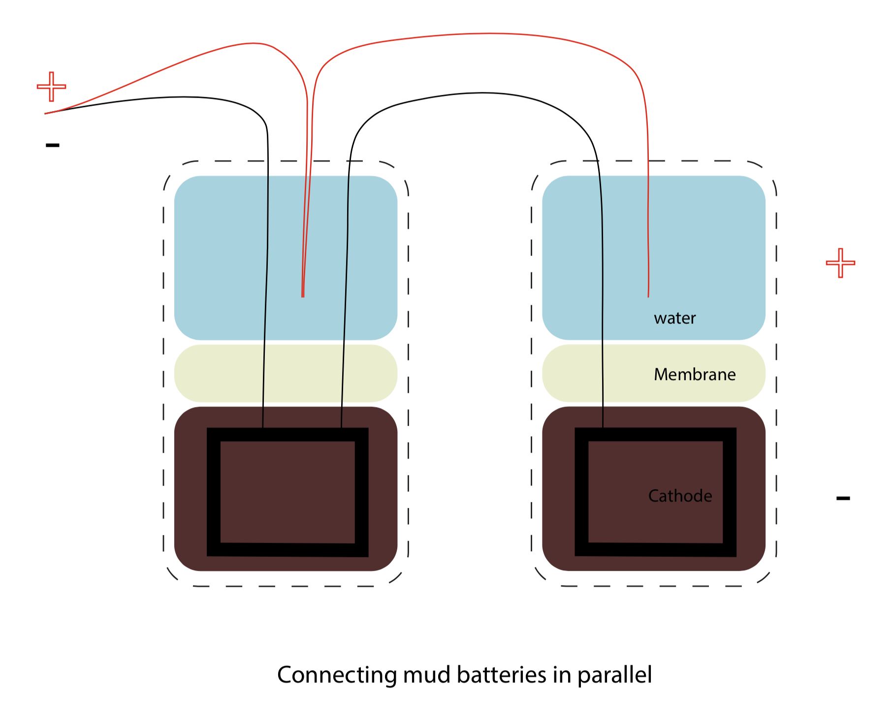

### After making the joel thief, the batteries will be connected to it. 

## Part 2 - Rethinking communication protocols - duration: 4 hours

Today we make an inductor circuit also referred to as a "joule thief" to amp up the small voltage we get from the mud battery. Take a look at [this video](https://www.instructables.com/Joule-Thief-Circuit-How-to-Make-and-Circuit-Explan/) to get the basic idea. We will replace the AA battery with our mud battery, and we will add a button to this circuit (and optional: a buzzer) to use it to make light and sound signals. Thus, we are creating the basic setup for encoding and sending information (on/off, zeros/ones, lights/no light, sound/no sound). With this workshop and the simple parameters it provides we propose to explore the concept of communication protocols that we encounter every day in implicit and explicit ways, AND create our own protocols for communication using a very bare bones, hyperlocal, low energy infrastructure!  

### Shared activity with all nodes: Collective reading - 45 mins

As part of the second part of this workshop we propose you read excerpts from the following text book before proceeding with the workshop: Galloway, A. R. (2004). *Protocol: How Control Exists after Decentralization*. Cambridge, MIT press: pp. 28-53 (chapter 1) and pp. 240-246 (conclusion) [PDF available here](./files/galloway_chap2_conclusion.pdf)

Then, let's meet on this [Etherpad](https://etherpad.hackersanddesigners.nl/p/soilpunk-workshop-hdsa2022) with all nodes on **Tuesday 9.00-10.00AM CET = 4.00-5.00 PM KST = 7.00-8.00 PM NZST** to discuss the text together. We will prepare some questions and prompts that will be released to activate and create a dramaturgy for the discussion in the pad. 

We will also have a [BBB room](https://bbb.constantvzw.org/b/hd4-tzj-me3-3sa) open. But most of the discussion will happen in writing on the pad. We hope through this shared moment we can facilitate an moment of connectedness across nodes/scripts/space/time.

If your schedule doesn't allow you to join this live session, we suggest you browse the pad afterwards (ideally before you start workshop day 2) and read through the discussion that unfolded (you may still add to it!)

### Introducing and exploring ideas - approx 45 mins

##### Collective exercises to set the scene for this workshop:  

The purpose of the following exercises is to exchange associations and thoughts about communication protocols in different contexts (walkie talkies, telephones, smoke signals, secret communication with classmates during exams, serial/SPI/I2C communication between computer chips, IP, interactions at the coffee machine) and to get a collective sense of what the knowledge and interest are of the group in relation to the topic of *alternative communication protocols*. We do not expect prior knowledge or answers/solutions to problems but depart from and work with the imagination and fascinations of the respective groups.

Hopefully by the end of the exercises we have to accumulated a collective vocabulary that sets into motion a direction for the communication protocols you will be making!

You could use an Etherpad (create your own pads here: [https://etherpad.hackersanddesigners.nl](https://etherpad.hackersanddesigners.nl)) or use a large piece of paper for this exercise.

**Exercise 1:**

*Facilitators release one question at a time and set a timer of 5 minutes per question:*

1. What do you associate with the term 'transmitting' -- 5 min
2. What do you associate with the term 'receiving' -- 5 min
3. What do you associate with the notion 'making yourself understood' -- 5 min
4. What do you associate with the notion 'feeling understood' -- 5 min

Responses to these prompts can be questions, openings, contradictions, fictions, ... _there is no right or wrong._ If there is time left, facilitators can invite participants to read some of the responses out loud and react to them.

**Exercise 2:** 

*Facilitators release one question at a time and set a timer for each question (minutes indicated)*

We all experience troubled transmission all the time. Broken connection, low bandwidth, frozen faces and unintended cliff-hangers in intimate conversations.... all gestures of infrastructures that tell but one thing "Connectivity is not to be taken for granted". 

1. Gather in groups of 3 
2. Pick a scenario of online communication/collaboration that everyone in your group can relate to (i.e. a video conferencing platform, whatsapp call, discord messaging, twitch streaming...) -- 5 min
3. Make an extensive inventory of utterances of 'bad' connectivity within online communication (i.e. frozen faces, distorted voices...) -- 10 min
4. Pick one that you find particulary irritating or fascinating, while imagining the context of glitchy, faulty and imperfectons as a basis for un/learning and rewiring. How could a communication protocol look like in this situation? How could we negotiate modes of communication? -- 15 min

**Potentially relevant background information:**  

* [Wikipedia page of Communication Protocols](https://en.wikipedia.org/wiki/Communication_protocol)
* [Youtube video "RFID Lab 1: Serial Peripheral Interface (SPI)"](https://youtu.be/kkMVv0dMavM) 
* ["S.M.S., smoke as a medium for the masses" by Dennis de Bel](http://dennisdebel.nl/2017/2014-sms2.0/)
* [Byfield, Ted (2008) “Information” in: Matthew Fuller (ed) *Software Studies: a Lexicon*. Massachussetts, MIT Press: p. 125-131.](https://www.google.com/url?sa=t&rct=j&q=&esrc=s&source=web&cd=&cad=rja&uact=8&ved=2ahUKEwiVsvmbrtf4AhXCuKQKHaMcBe8QFnoECA8QAQ&url=https%3A%2F%2Fmonoskop.org%2Fimages%2Fa%2Fa1%2FFuller_Matthew_ed_Software_Studies_A_Lexicon.pdf&usg=AOvVaw3hRsaRblaUFCh9FChmyOqc)
* *The commons: Infrastructures for troubling times* by Lauren Berlant (this text is part of the reader)

**References from the field of computing:**

* Binary counting system: [https://learn.sparkfun.com/tutorials/binary](https://learn.sparkfun.com/tutorials/binary)
* I2C protocol (note the insert on changing terminology to describe relationship between devices): [https://learn.sparkfun.com/tutorials/i2c/all](https://learn.sparkfun.com/tutorials/i2c/all)
* SPI protocol: [https://learn.sparkfun.com/tutorials/serial-peripheral-interface-spi/all#whats-wrong-with-serial-ports](https://learn.sparkfun.com/tutorials/serial-peripheral-interface-spi/all#whats-wrong-with-serial-ports)

### Make a Joule Thief - approx 60 mins

This paragraph describes how you can build an inductor circuit that can power an LED with as little as 0.65V (in comparison: typically you need 2V). Our mud battery is likely to be able to supply this amount after 24 hours if all went well. We added a button to the circuit so the device can double as an extremely simple communication device. By connecting the LED you can send light patterns using the button. If you replace the LED with the little buzzer you can send sound signals. 

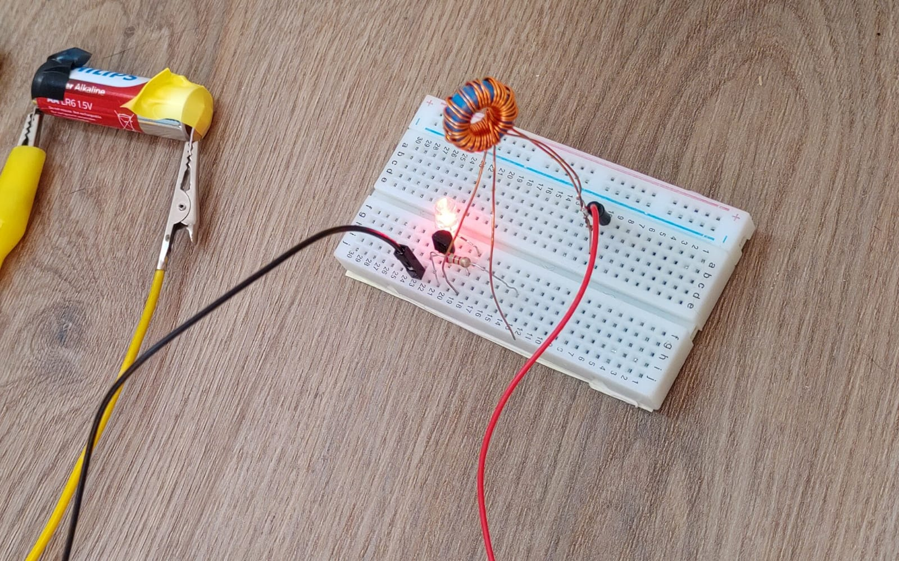

Build a joule thief circuit with the components provided, following the step-by-step instructions in the script (an adaptation of this [Dutch tutorial](https://ingegno.be/realisations/jouledief.html)) There are a lot of similar tutorials so if anything is unclear it's worth looking around a bit, maybe somebody else has a way of explaining that is clearer for you :) 

[Video of the working circuit with a LED](https://www.youtube.com/watch?v=umFwwJs-5BA)

[Video of the working circuit with a buzzer](https://www.youtube.com/watch?v=va7Zxcri2gk)

##### Step 1: prepare the inductor 

* Gather the tools and materials listed at the top. 

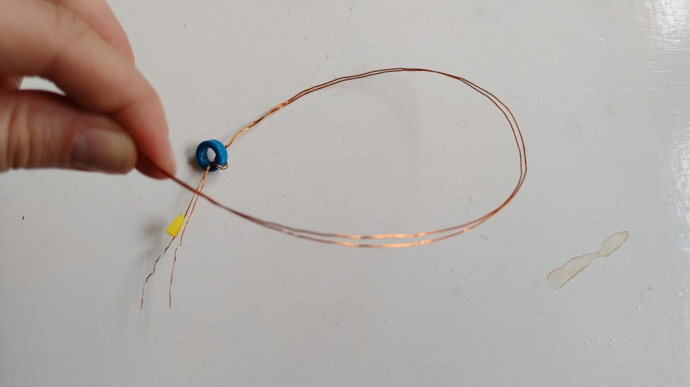

- take approx. 100 cm of enameled copper wire and fold in half
- try not to make bumps and tangles, keep wire nice and smooth
- loop the closed end through the ferrite toroid, keep about 4 cm 

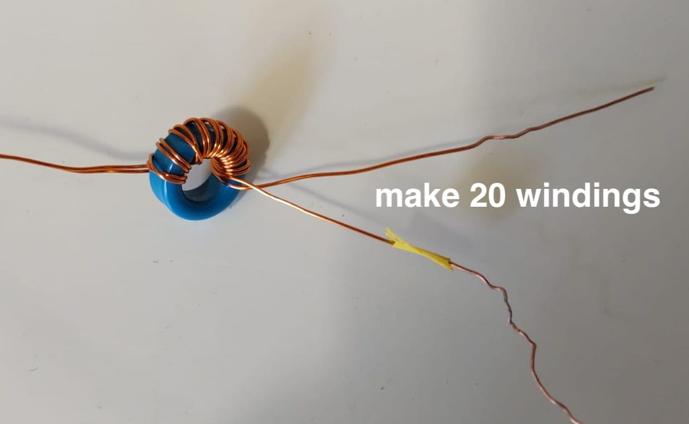

- make 20 windings with the double wire, make sure they sit next to each other neatly.
- clip the ends, make sure you have about 4 cm left
- now clip the closed end of the loop from the beginning of the coil
- you now have 2 separate wires wrapped around the ring, creating 4 loose leads: 2 going into the coil , and 2 coming out of the coil at the end of your winding.

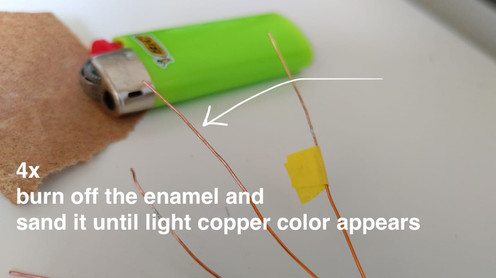

- for all four ends, take a lighter and burn off the plastic enamel wrapping the copper wire (you might not see it but it's there and acts as an insulator, preventing electricity to go through). 
- sand off the ends until you see copper color that is slightly lighter than before.
- next, you want to take a lead from the beginning of (and going into) the coil, and connect it to an one of the end leads coming out of the coil. But these two should not be the same wire! So check with the multimeter that it's the other wire you are connecting (see images). Wrap these around each other a couple times, making sure you still have 2 cm untangled wire at the end. In the pictures we marked the two different wires with two piece of tape before coiling, then you can see it without a multimeter too. 

- take a multimeter and match which lead at the beginning is connected to an end lead (use the continuity setting, if it beeps, it's the same wire).

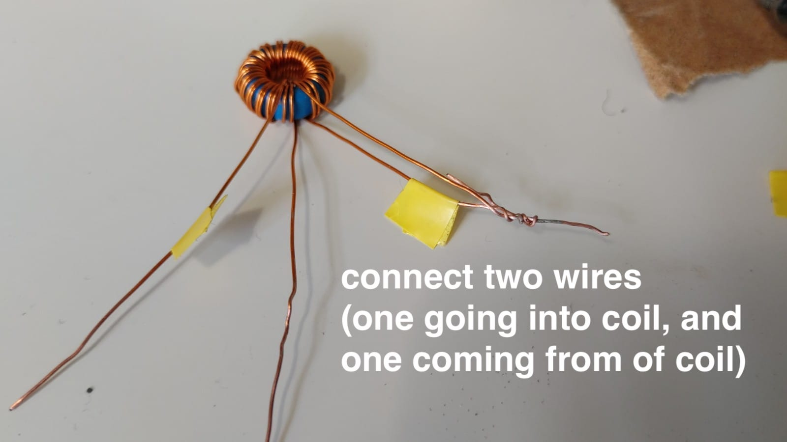

- this is your inductor! the two connected leads will be connected to the positive + side of your AA or mud battery, and the two other separate leads are connected to the transistor and the resistors as shown in the images of the circuit. 

More info about joule thieves and its history on [wikipedia](https://en.wikipedia.org/wiki/Joule_thief)

##### Step 2: make the circuit with an LED

Gather all your components. These should be in the kit provided to your node, or if you are a remote participant, you will have received a shopping list. The parts might look slighty different but recognisable. You will also receive a battery clip for easier connecting to the breadboard with crocodile clips.

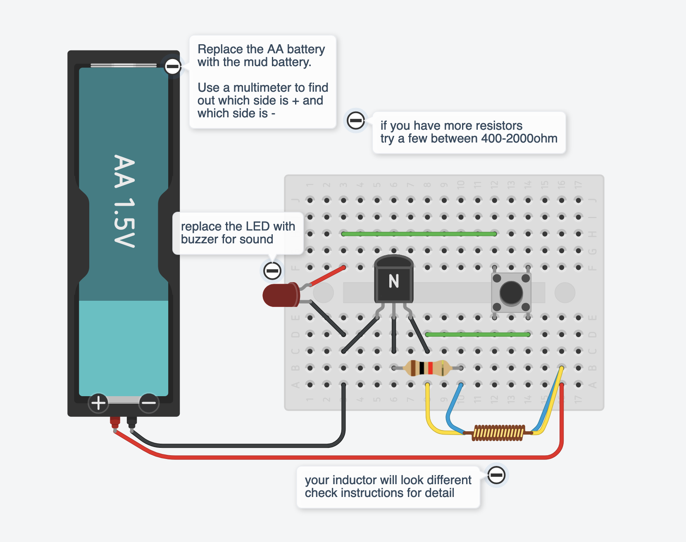

**LED:**
Note that this part has polarity, so should be connected with the right orientation. The LONGER leg (usually with the bend) is marked in RED in the diagrams. The SHORTER leg is marked in BLACK in the images and is always connected to GND (or -).

**NPN transistor:** Note that this part also has an orientation. In the diagram you see that the transistor's flat side is facing you, and the round side is facing the away. Make sure you copy this orientation when you connect it to your breadboard.

**Your inductor coil:** obviously looks different :) In the diagram you see the two wires making up the coil marked with a different color (blue or yellow). Ours are both copper colored but you will have marked them with tape or measured with a multimeter. The leads on the right are connected to row 16, with the + side of your battery. You can either wrap them making one leg so to speak, or keep them separated and just connect both on the same row. Both options are a way of connecting them.

The leads on the left side of the coil are not connected to each other. One goes to the right leg of the transistor (row 8) and one is connected to the the resistor (row 10).

**Button:** has 4 legs. In the diagram, the two legs on the left are connected, and the two legs on the right side are connected too. When the button is pressed, the left side and the right side make a connection too (allowing electrons to flow). On the back side you can see marks showing you which legs are connected. If unsure, check with the multimeter (continuity setting). If your button is not working, you can try rotating it 90 degrees, you might have it connected in the wrong orientation.

**Resistor:** has no orientation, either way is fine. You can influence the working of the circuit a bit by trying different values. If you have more resistors: try some in the range of 400-2000ohm and see what happens!

**Buzzer:** you can use a buzzer by replacing the LED. Just take the LED out and place the puzzer in the rows of the breadboard where the LED used to be. Because the circuit acts as an oscillator, creating a waveform, it can also drive a buzzer. Both are components that can operate like that. You cannot however drive an IC chip with an oscillator. 

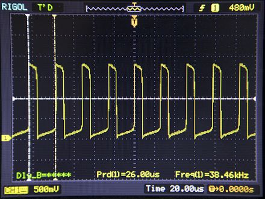

In case you want to know the schematic (a bit abstract but can be helpful sometimes)

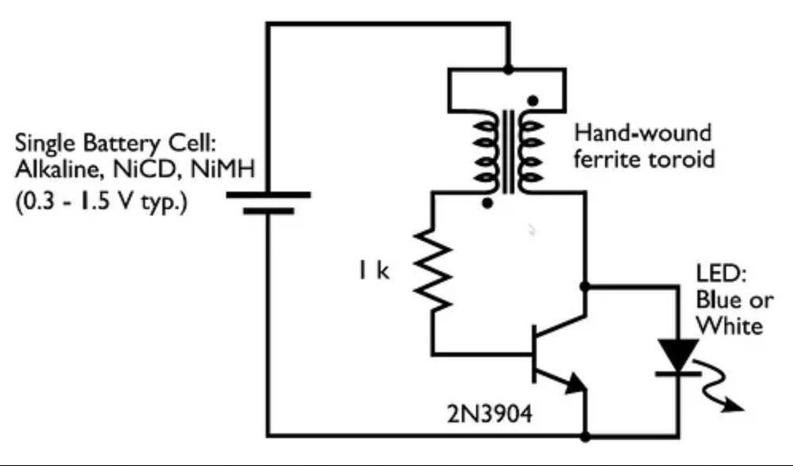

##### Step 3: test the circuit with a 1.5V battery

Check that your circuit works by connecting one 1.5V AA battery to it. The LED should go on when you press the button. If it doesn't work: 

1. check all the connections again, wiggle them a little, make sure they're firmly in the breadboard
2. check again that all the connections are in the right rows/columns on the breadboard
3. try another battery (safe bet is to try with one that has at least 1V left)
4. Try a coil with a different amount of windings (somebody whose circuit is working probably has a good coil too, ask if you can borrow it to check whether your coil is the problem). If so: change the amount of windings.

**Flickering LED?** The copper wire is a bit too thin for the holes in the breadboard. If you get a lot of flickering when you connect it to a battery, you probably need to help those connections a little bit. You can cut three short pieces of solid core hookup wire, strip the ends, and solder them to the coil leads. This will help them connect better. 

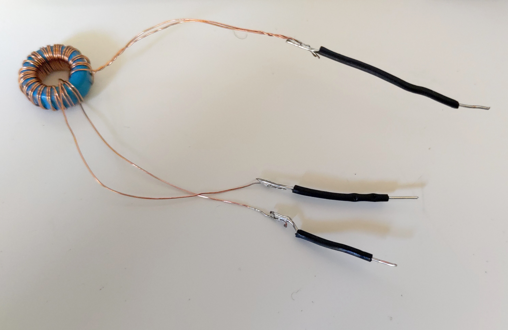

***Optional***: replace the LED with a **buzzer** to send sound signals. The sound may be lower/higher depending on the amount of windings in your coil, and the Voltage of the battery. Changing the value of the resistor can tweak this a bit (try some resistors in the 400-2000 Ohm range if you have them).

##### Step 4: connect the mud battery to the circuit

Test the mud batteries with a voltmeter and find the positive and negative pole. 

* Find the positive and the negative pole. If you try to measure the Voltage of the battery and the display gives a negative value: your probes are the wrong way around (you're holding the black lead to the positive pole of the battery instead of the negative pole). If it reads a positive value: your red probe is touching the positive pole and the black probe is touching the negative pole. With this information you should be able to replace your AA battery with the mud battery the right way around. 
* if it measures 0.6V or higher proceed with single battery
* if it measures less than 0.6V, connect two mud batteries in series. For more info: [https://www.batterystuff.com/kb/articles/battery-articles/battery-bank-tutorial.html](https://www.batterystuff.com/kb/articles/battery-articles/battery-bank-tutorial.html) 

* Connect the mud battery to Joule Thief Module by taking away the AA battery and putting the mud battery in its place (make sure the positive pole goes where the positive pole of the battery was and vice versa. If you look at the diagram

	- Connect the negative end to the hole #3 on the breadboard 
	- Connect the positive end to the hole #16 on the breadboard

### Design a communication protocol for your device - approx 60 mins

Pair up or make groups to design a communication protocol and read through the following paragraph together. Then explore some of these questions to design your protocol.  

How can you convey information with only on/off? How does the receiver now when to be alert? How do they know when the message is ended? Communicating is as much about listening as it is about sending. What might be ways to attune? How might this translate to the simplest of forms? In comparison: a simple walkie talkie protocol entails some agreements such as: 

* opening with: "person A to person B, over"
* responding with: "person B to person A, over"
* closing with: "over and out"

Here you see there's a certain signal dedicated to alert the listener(s) that a message is coming and they should keep their eyes/ears peeled. And similarly, when they can rest easy. The sender might want to know that the listener is actually there and they're not taking to a wall.  Or that the message did or did not come across clearly and they might need to repeat. 

Research and think a bit more on this together, and try to create an analog communication protocol for your joulethief messaging device. Some questions to think about when designing a protocol:

* the scale from bits to meaning (from on/off to full-blown storytelling and everything in between), what do you want to convey? e.g. an SMS (160 characters), an emoji, an image, a phone number, a piece of music, other, calling your dog to come back into the house, other? 
* speed (how fast can you speak/listen?)
* size (how long can you speak/listen?)
* access (who can speak/listen on your channels?)
* time (making sure you are on the same clock)
* how to identify the start of communication? 
* how to identify the end of communication? 
* how to make sure someone is actually listening?

### Bringing it all together - approx 30 mins

* Connect your joule thief to the mud battery and see if it works. We haven't tried this yet, so it really is an experiment! 
* Try sending information using your joulethief, using your communication protocol
* Share the resulting messages, discuss how and when entropy (noise) entered the process and what that means for what and how is communicated.
* Display your mud batteries with LED lights in your space :) 

### BONUS OPTION

If it's all working and you still have time left, you could solder the the joulethief, instead of connecting it via the breadboard and make an installation of sorts. 

------------------

## WORKSHOP VERSION 2 (HYBRID) 

Duration: from 4 hours (half a day) up to 8 hours spread out over 2 days, depending on selected activities

Materials list should be shared with remote participants ASAP so they can order components and do shopping.

Node facilitates a session for participant to pair up based on shared interest, choose one or more of the following:

* Join the collective reading moment that will take place inside this [etherpad](https://etherpad.hackersanddesigners.nl/p/soilpunk-workshop-hdsa2022) with all nodes on **Tuesday 9.00-10.00AM CET = 4.00-5.00 PM KST = 7.00-8.00 PM NZST** to discuss the text by Alexander Galloway. 
* Make a mud battery (work together remotely in small groups, those who were able to get materials), note that it needs to rest to charge! 
* Make a joulethief (those who were able to get the materials) and use it with an old half-empty AA battery
* Design a communication protocol and test it out via webcam/audiocall. This can be done with readily available household materials, like a small torch or penlight, knocking on the table for sound, flashing a red piece of paper at a webcam.

Before starting: decide on moments to check back in together, and when you will stop working on the activity, and how and when you would like to wrap it up (e.g. sharing and discussing with all participants in the node). 

